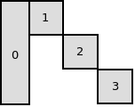
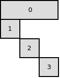

# Introduction

BlockDecomposition.jl is a package providing features to take advantage of the shape
of block structured problem; in other words, problems on which Dantzig-Wolfe
decomposition or Benders decomposition can be applied.

!!! note
    This package provides:
        1. a JuMP modeling layer for describing Benders decomposition
        2. a JuMP modeling layer for describing Dantzig-Wolfe decomposition
        3. an interface to write customized oracles for (Benders/Dantzig-Wolfe) subproblems

    Only the first feature is supported by a solver for now (CPLEX 12.7)

## Benders decomposition


Consider the following problem

```math
\begin{array}{c c c c c c c c}
\text{min}       & \sum_{\alpha=1}^h f'_\alpha y_\alpha      & + & \sum_{\alpha=1}^i f_{1,\alpha} x_{1,\alpha} & + & \sum_{\alpha=1}^j f_{2,\alpha} x_{2,\alpha} & + & \sum_{\alpha=1}^k f_{3,\alpha} x_{3,\alpha} &       \\
\text{c}_{1,1}  & \sum_{\alpha=1}^h a_{1,1,\alpha} y_\alpha & + & \sum_{\alpha=1}^i b_{1,\alpha} x_{1,\alpha} &   &                                             &   &                                             & \geq \beta_{1,1} \\
\vdots           &                                           &   & \vdots                                      &   &                                             &   &                                             &       \\
\text{c}_{1,n}: & \sum_{\alpha=1}^h a_{1,n,\alpha} y_\alpha & + & \sum_{\alpha=1}^i b_{n,\alpha} x_{1,\alpha} &   &                                             &   &                                             & \geq \beta_{1,n} \\
\text{c}_{2,1}: & \sum_{\alpha=1}^h a_{2,1,\alpha} y_\alpha & + &                                             &   & \sum_{\alpha=1}^j c_{1,\alpha} x_{2,\alpha} &   &                                             & \geq \beta_{2,1} \\
\vdots           &                                           &   &                                             &   & \vdots                                      &   &                                             &       \\
\text{c}_{2,p}: & \sum_{\alpha=1}^h a_{2,p,\alpha} y_\alpha & + &                                             &   & \sum_{\alpha=1}^j c_{p,\alpha} x_{2,\alpha} &   &                                             & \geq \beta_{2,p} \\
\text{c}_{3,1}: & \sum_{\alpha=1}^h a_{3,1,\alpha} y_\alpha & + &                                             &   &                                             &   & \sum_{\alpha=1}^k d_{1,\alpha} x_{3,\alpha} & \geq \beta_{3,1} \\
\vdots           &                                           &   &                                             &   &                                             &   & \vdots                                      &       \\
\text{c}_{3,q}: & \sum_{\alpha=1}^h a_{3,q,\alpha} y_\alpha & + &                                             &   &                                             &   & \sum_{\alpha=1}^k d_{q,\alpha} x_{3,\alpha} & \geq \beta_{3,q} \\
\end{array}
```  

The coefficients matrix has the following block structure :



Hence, we can apply [Benders decomposition](https://en.wikipedia.org/wiki/Benders_decomposition) on this problem.

We partition the variables.
- Variables ``y_\alpha``, ``\alpha\in \{1 \ldots h\}`` are in the master.
- Variables ``x_{1,\alpha}``, ``\alpha \in \{1 \ldots i\}`` are in the first subproblem.
- Variables ``x_{2,\alpha}``, ``\alpha \in \{1 \ldots j\}`` are in the second subproblem.
- Variables ``x_{3,\alpha}``, ``\alpha \in \{1 \ldots k\}`` are in the third subproblem.

Assume that ``m`` is the compact formulation written with [JuMP](https://github.com/JuliaOpt/JuMP.jl).

The user must create a function to describe this decomposition. Such function could be:

```julia
function b_decomp(var_name, var_id)
    if var_name == :y
        return (:B_MASTER, 0)
    else
        return (:B_SP, var_id[1])
    end
end
add_Benders_decomposition(m, b_decomp)
```

## Dantzig-Wolfe decomposition

Consider the following problem :

```math
\begin{array}{c c c c c c c}
\text{minimize}  & \sum_{\alpha=1}^i f_\alpha x_\alpha     & + & \sum_{\alpha=1}^j f_{i+\alpha} x_{i+\alpha}     & + & \sum_{\alpha=1}^k f_{i+j+\alpha} x_{i+j+\alpha}   &      &             \\
\text{mc}_{1}:   & \sum_{\alpha=1}^i a_{1,\alpha} x_\alpha & + & \sum_{\alpha=1}^j a^{1}_{i+\alpha} x_{i+\alpha} & + & \sum_{\alpha=1}^k a_{1,i+j+\alpha} x_{i+j+\alpha} & \geq & \beta_{0,1} \\
\vdots           & \vdots                                  &   & \vdots                                          &   & \vdots                                            &      &             \\
\text{mc}_{m}:   & \sum_{\alpha=1}^i a_{m,\alpha} x_\alpha & + & \sum_{\alpha=1}^j a^{m}_{i+\alpha} x_{i+\alpha} & + & \sum_{\alpha=1}^k a_{m,i+j+\alpha} x_{i+j+\alpha} & \geq & \beta_{0,m} \\
\text{sc}_{1,1}: & \sum_{\alpha=1}^i b_{1,\alpha} x_\alpha &   &                                                 &   &                                                   & \geq & \beta_{1,1} \\
\vdots           & \vdots                                  &   &                                                 &   &                                                   &      &             \\
\text{sc}_{1,n}: & \sum_{\alpha=1}^i b_{n,\alpha} x_\alpha &   &                                                 &   &                                                   & \geq & \beta_{1,n} \\
\text{sc}_{2,1}: &                                         &   & \sum_{\alpha=1}^j c_{1,i+\alpha} x_{i+\alpha}   &   &                                                   & \geq & \beta_{2,1} \\
\vdots           &                                         &   & \vdots                                          &   &                                                   &      &             \\
\text{sc}_{2,p}: &                                         &   & \sum_{\alpha=1}^j c_{p,i+\alpha} x_{i+\alpha}   &   &                                                   & \geq & \beta_{2,p} \\
\text{sc}_{3,1}: &                                         &   &                                                 &   & \sum_{\alpha=1}^k d_{1,i+j+\alpha} x_{i+j+\alpha} & \geq & \beta_{3,1} \\
\vdots           &                                         &   &                                                 &   & \vdots                                            &      &             \\
\text{sc}_{3,q}: &                                         &   &                                                 &   & \sum_{\alpha=1}^k d_{q,i+j+\alpha} x_{i+j+\alpha} & \geq & \beta_{3,q} \\
\end{array}
```

The coefficients matrix has the following block structure :



Hence, we can apply [Dantzig-Wolfe decomposition](https://en.wikipedia.org/wiki/Dantzig%E2%80%93Wolfe_decomposition)
on this problem.

We partition the constraints.
- Constraints ``\text{mc}_1`` to ``\text{mc}_m`` are in the master.
- Constraints ``\text{sc}_{1,1}`` to ``\text{sc}_{1,n}`` are in the first subproblem.
- Constraints ``\text{sc}_{2,1}`` to ``\text{sc}_{2,p}`` are in the second subproblem.
- Constraints ``\text{sc}_{3,1}`` to ``\text{sc}_{3,q}`` are in the third subproblem.

As for Benders decomposition, the user must
to create function to describe this decomposition. Such function could be: ::

```julia
function dw_decomp(constr_name, constr_id)
    if constr_name == :mc
        return (:DW_MASTER, 0)
    else
        return (:DW_SP, constr_id[1])
    end
end
add_Dantzig_Wolfe_decomposition(m, dw_decomp)
```
